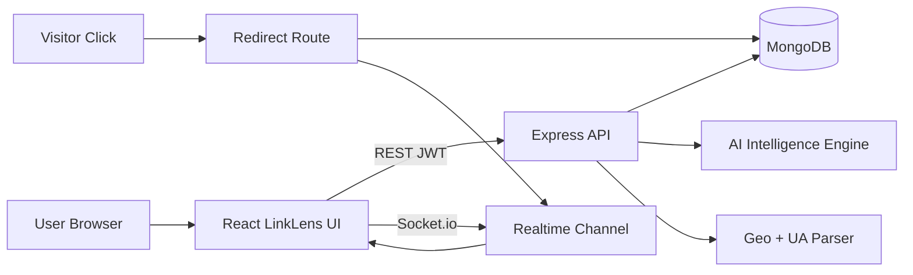
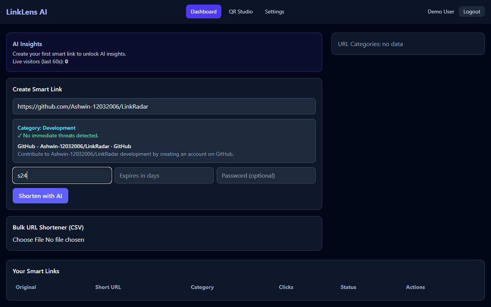
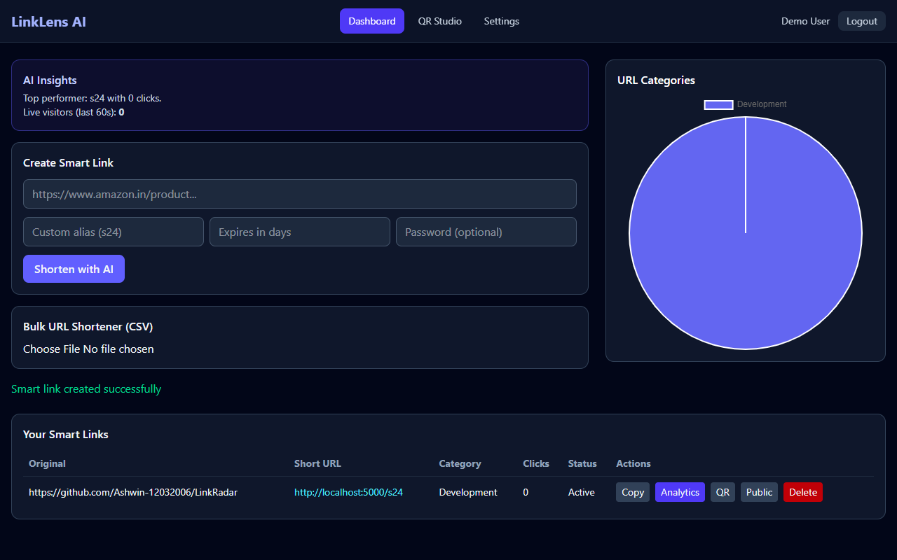
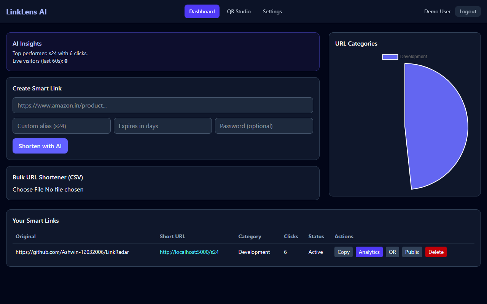
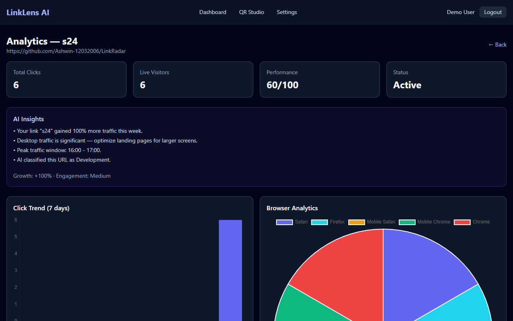
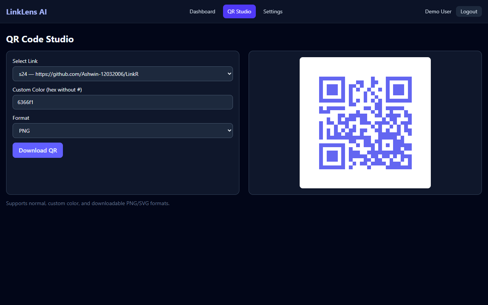
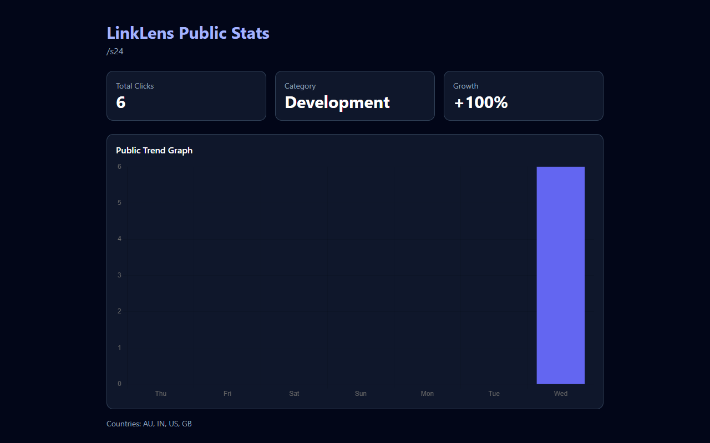

# LinkLens AI — Smart URL Intelligence Platform

**LinkLens AI** is a hackathon-grade URL shortener that goes beyond basic click counting. It combines AI-style URL intelligence, security checks, live visitor tracking, rich analytics, QR studio, and public stats into one cohesive product.

## Why This Stands Out

Most teams submit: login, shorten URL, click count, basic table.

LinkLens AI adds judge-friendly differentiators:

- AI URL category detection (E-Commerce, Entertainment, Development, etc.)
- Smart threat detection before shortening
- Live visitor tracking via Socket.io
- Visitor journey timeline
- Region heat insights (India-focused geo aggregation)
- Browser/device pie analytics
- Click trend charts (Chart.js)
- AI insights summary panel
- Performance score + achievement badges
- QR Code Studio (custom color, PNG/SVG download)
- Expiring links + expired redirect page
- Password-protected links
- Bulk CSV shortening
- Public statistics page
- URL preview card (title/description)

## Tech Stack

| Layer | Stack |
|-------|-------|
| Frontend | React, Vite, Tailwind CSS, Framer Motion, Chart.js, React Router, Socket.io Client |
| Backend | Node.js, Express, Socket.io, JWT, bcrypt |
| Database | MongoDB + Mongoose |
| Intelligence | Rule-based AI classification, threat heuristics, insights engine |
| Analytics | GeoIP-lite, UA Parser, visit aggregation |

## Project Structure

```text
Katomarans/
├── client/                 # React app (LinkLens UI)
│   └── src/pages/          # Landing, Dashboard, Analytics, QR, Settings, Public Stats
├── server/                 # Express API + redirect + realtime
│   └── src/
│       ├── models/         # User, Link, Visit
│       ├── routes/         # auth, links, public, redirect
│       ├── services/       # link creation + analytics composition
│       └── utils/          # intelligence + analytics + visit metadata
└── README.md
```

## Setup Instructions

### Prerequisites

- Node.js 18+
- MongoDB running locally or MongoDB Atlas URI

### 1) Backend

```bash
cd server
cp .env.example .env
npm install
npm run dev
```

`server/.env` values:

```env
PORT=5000
MONGO_URI=mongodb://127.0.0.1:27017/linklens
JWT_SECRET=replace_with_strong_secret
CLIENT_URL=http://localhost:5173
BASE_URL=http://localhost:5000
BRAND_NAME=LinkLens AI
```

### 2) Frontend

```bash
cd client
cp .env.example .env
npm install
npm run dev
```

### 3) Run

- App UI: http://localhost:5173
- API health: http://localhost:5000/api/health
- Short redirect example: http://localhost:5000/s24

## Core API Endpoints

- `POST /api/auth/signup`
- `POST /api/auth/login`
- `PATCH /api/auth/profile`
- `POST /api/links/analyze` — category + threat + preview
- `POST /api/links` — create smart link
- `POST /api/links/bulk` — CSV upload
- `GET /api/links` — user links
- `GET /api/links/:id/analytics` — full analytics package
- `GET /api/links/:id/qr` — QR output
- `GET /api/links/dashboard/summary` — category pie data
- `GET /api/public/stats/:shortCode` — public stats page data
- `POST /api/public/unlock/:shortCode` — password-protected access
- `GET /:shortCode` — server-side redirect + visit tracking

## AI Planning Workflow (Documented)

1. **Problem reframed**: build intelligence platform, not just shortener.
2. **Data model designed**: `User`, `Link`, `Visit` with intelligence fields.
3. **Intelligence services**: category detection, threat checks, preview extraction.
4. **Analytics pipeline**: browser/device/region/trend/insights/score/badges.
5. **Realtime layer**: Socket.io live visitor pulses.
6. **UX mapped**: Landing → Auth → Dashboard → Analytics/QR/Settings/Public Stats.
7. **Security boundaries**: JWT ownership checks, hashed passwords, protected-link cookies.
8. **Submission docs**: setup, assumptions, architecture, demo video checklist.

## Architecture Diagram



## Assumptions

- GeoIP accuracy depends on IP quality; local dev may show `Unknown`/`localhost`.
- Threat detection uses heuristic rules (not external paid threat API).
- “AI” insights are generated from analytics patterns (transparent and explainable in interview).
- Public stats only appear when link has public stats enabled (default: enabled).
- Short redirects are served from backend `BASE_URL` port.

## Automated End-to-End Walkthrough

### 🎥 Watch the Demo Video Walkthrough
- **Direct Video stream:** [https://github.com/Ashwin-12032006/Linklens-AI/raw/main/demo_walkthrough.mp4](https://github.com/Ashwin-12032006/Linklens-AI/raw/main/demo_walkthrough.mp4)
- **Watch in Browser:** [https://github.com/Ashwin-12032006/Linklens-AI/blob/main/demo_walkthrough.mp4](https://github.com/Ashwin-12032006/Linklens-AI/blob/main/demo_walkthrough.mp4)

We have built a fully automated Puppeteer-based end-to-end demo runner that executes the entire user flow: Sign up -> Paste URL -> Analyze URL -> Create `s24` Custom Alias -> Simulate visitor traffic -> Capture live Analytics, QR code Studio & Public statistics.

### Run the Demo Locally
You can run this demo yourself locally using:
```bash
node run_demo.js
```
The screenshots are automatically captured and saved under `demo_screenshots/`.

### Demo Steps & UI Screenshots

#### Step 1: URL Analysis & Preview Card
When a long URL is pasted, the backend performs AI-based category classification, threat heuristic scanning, and extracts title/description preview data:


#### Step 2: Dashboard Overview & Link Created
After creating the `s24` smart link:


#### Step 3: Simulated Traffic Aggregation
Live click simulation with various User-Agents and IP addresses (e.g. India, US, UK):


#### Step 4: Core Analytics Dashboard
Visitor geolocation heatmaps, browser pie charts, click trend timeline charts, and AI-powered performance insights:


#### Step 5: QR Code Studio
Dynamic high-definition QR Code generator supporting custom brand hex-colors and downloads in SVG/PNG format:


#### Step 6: Public Stats Portal
Secure public-facing statistics portal page that shows public traffic analytics and trend charts:


## Sample Output To Capture

- Terminal logs (`Server running`, `POST /api/links`, redirect logs)
- UI screenshots (dashboard, analytics, QR, public stats)
- MongoDB entries for `users`, `links`, `visits`

## Hackathon Winning Feature Checklist

- [x] Custom Alias
- [x] QR Generator
- [x] Expiry Links
- [x] Password Protected Links
- [x] Device/Browser Analytics
- [x] Visitor Timeline
- [x] AI Insights Dashboard
- [x] Click Trend Charts

This project is a part of a hackathon run by https://katomaran.com
